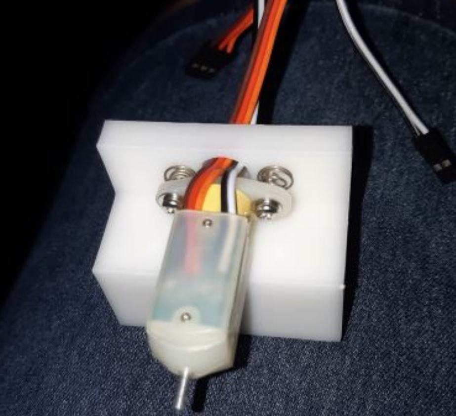

Latest Marlin firmware for Leapfrog Creatr Hs based on Marlin 2.0.0 Beta

100% Compatible with the original mainboard

### WARNING ! 	
These releases seems to break communication with the display (Olimex A20). 

( Probably because by defaut Creatr HS use Checksumed Protocol ? )
### WARNING ! 	

## Marlin BLTouch (same Standard settings)
- Add BLTouch
- Connect Z (Black/White) on Zmin connector
- Connect SERVO0_PIN on 52 (SCK) (physical pin 20 of ATMega2560) (see pictures)
 
Once installed, use this sequence to determine if the BLTouch is setup properly :

    Connect BLTouch, power up controller and upload the firmware
    
    LED will be ON if a servo signal is present.
    
    M119		; should return OPEN. If not check that the BLTouch is enabled in the configuration. If enabled then check wiring and Check that the correct pin is being used. Also check that Z_MIN_ENDSTOP_INVERTING and Z_MIN_PROBE_ENDSTOP_INVERTING are both set to "false".
    
    M280 P0 S10 	; should deploy the probe and the orange LED will be OFF.
    
    M119 		; should return OPEN
    
    M280 P0 S90 	; should stow the probe and the orange LED will be ON
    
    M280 P0 S60 	; puts it into the M119 test mode.
    		; The probe should remain stowed and the blue LED should be OFF. If it's ON then the unit needs to be adjusted.
    
    M119 		; should return TRIGGERED
    
    M280 P0 S160 	; returns it to normal operation
    
    M119 		; should return OPEN.
    
  After this Z offset needs to be callibrated !!!
  A good video guide to use for this is  https://www.youtube.com/watch?v=y_1Kg45APko&list=FLQG47LoNpPy0yjQeLG1prTA&index=2&t=0s
  
  Also make sure you setup your gcode correctly so auto bed leveling is done on every print
  See Simplify3d profiles for more info

			
Future update : 
 
-Upgrade to 32bit controller board
-Replacing the Olimex display for a touch display
-Upgrade Olimex to Octoprint

 
Forked from : https://github.com/CoyoteProd/Leapfrog-Creatr-HS/tree/master/Marlin%20BLTouch

Original Firmware : https://github.com/Leapfrog3DPrinters/CreatrHS_Firmware_2.5
